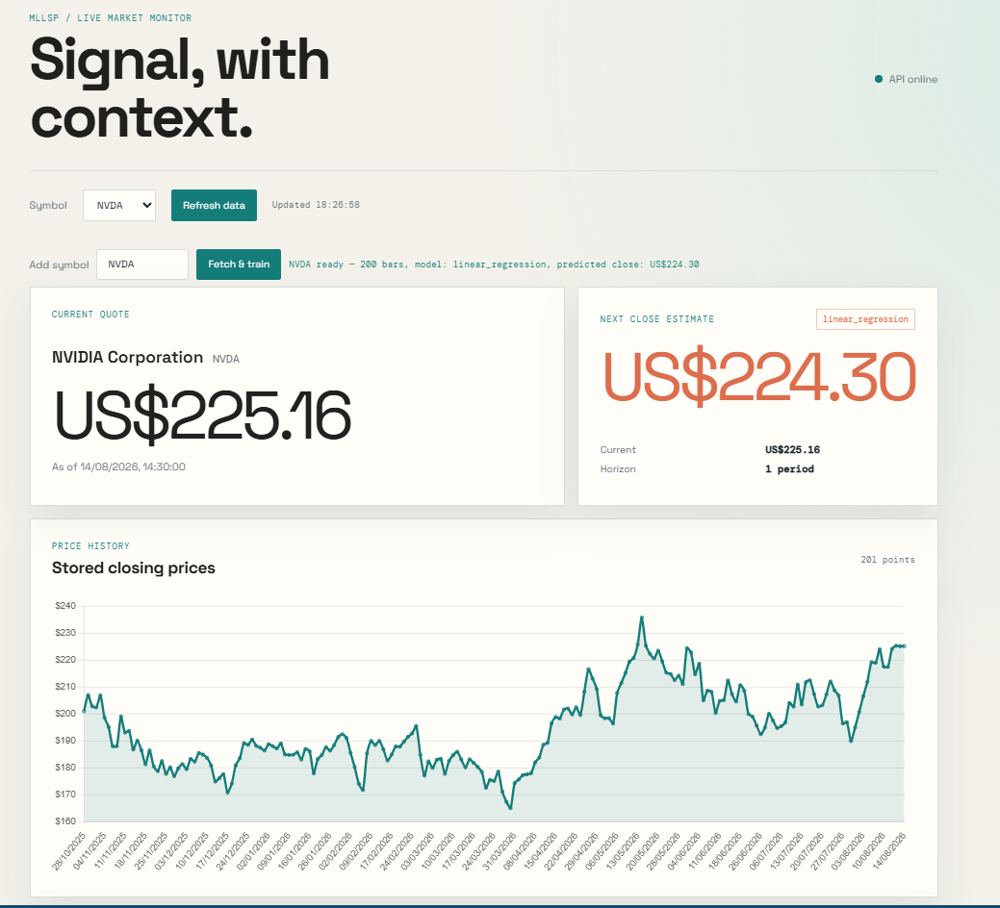

# MLLSP
Machine Learning Live Stocks Prediction

## Technology stack

- **Backend:** Python, FastAPI, Uvicorn
- **Database:** SQLite with SQLAlchemy
- **Data processing:** pandas and NumPy
- **Machine learning:** scikit-learn and joblib
- **Market data:** Twelve Data API
- **Frontend:** Static HTML and JavaScript

## Documentation

- [Setup guide](docs/setup.md)
- [Project outline](docs/project_outline.md)
- [Project structure](docs/project_structure.md)
- [Milestones](docs/milestones.md)
- [Milestone 1 test notes](docs/Tests/testM1.md)
- [Milestone 2 test notes](docs/Tests/testM2.md)
- [Milestone 3 test notes](docs/Tests/testM3.md)
- [Milestone 4 test notes](docs/Tests/testM4.md)
- [Milestone 5 test notes](docs/Tests/testM5.md)
- [Milestone 3 analysis notebook](docs/notebooks/MLLSP.ipynb)

## Workflow 
How it works: 

Using the Twelve data API we use a request to ingest past closing prices of a companies stock. 
[ingestion](src\backend\ingestion)

These can then be saved to the database
[database](mllsp.db)

We can then use are jupiter notebook to visualise and train the data to predict the next closing price the next day. Features are created and
Models are trained and evaluated
[notebook](docs\notebooks\MLLSP.ipynb)
    
Model files and metadata are saved
[Model](src\backend\training\models)  

These can then be viewed using an api request in the frontend. 
[frontend](src\Frontend)
